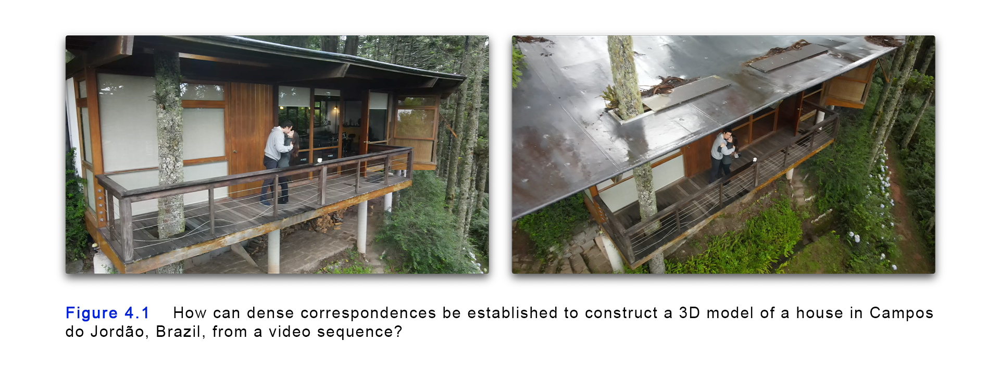
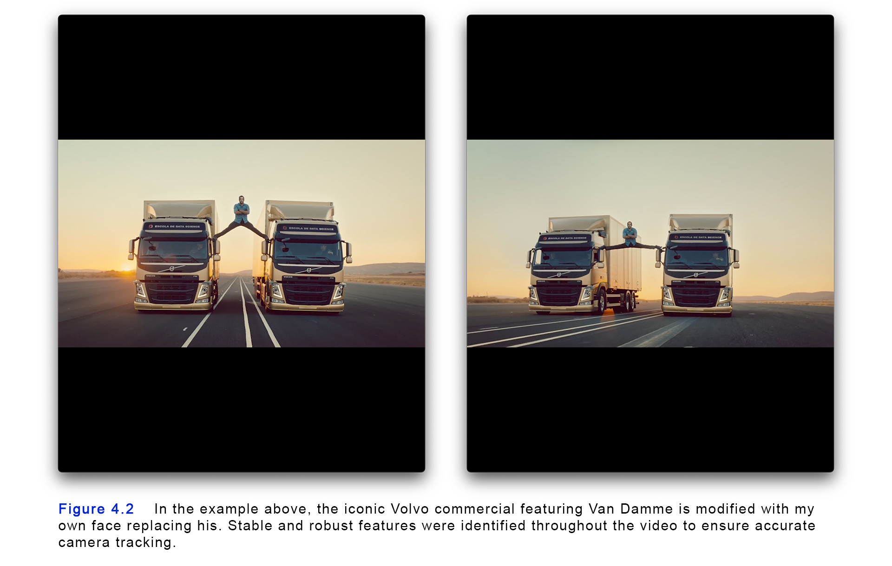

# 4. Feature Detection and Matching

[Insert introduction here]

## 4.1

[Insert content for section 1 here]

### Subsection 1.1

[Insert content for subsection 1.1 here]

### Subsection 1.2

[Insert content for subsection 1.2 here]

## Section 2

[Insert content for section 2 here]

### Subsection 2.1

[Insert content for subsection 2.1 here]

### Subsection 2.2

[Insert content for subsection 2.2 here]

## Conclusion

[Insert conclusion here]
