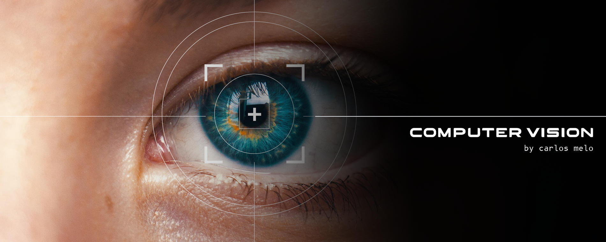

# VisionHub: Computer Vision Explained

This repository contains codes, notebooks, and educational materials related to Computer Vision. Covering a variety of computer vision applications and techniques, the goal is to continuously update this repository with my personal study notes and projects.

# About the Instructor

I am a <strong>Computer Vision Engineer</strong> with a degree in Aeronautical Sciences from the Air Force Academy and hold a <strong>Master's in Aerospace Engineering</strong> from the Aeronautics Institute of Technology (ITA). In 2019, I founded Sigmoidal, a company specializing in CV&ML consulting and immersive training programs. To date, I have educated over 6,000 students in Machine Learning and Computer Vision.

 
